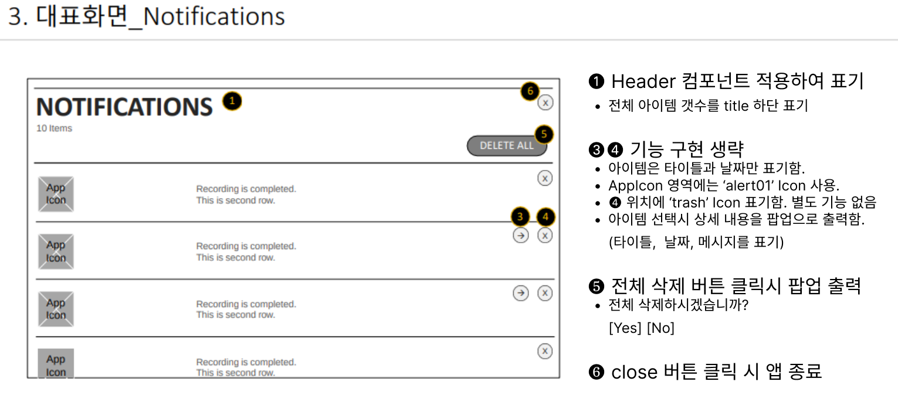

# Enact Framework와 webOS 앱 개발

## Why: Enact Framework가 필요한 이유 (10분)

### webOS 플랫폼의 특징과 도전 과제
- LG 스마트 TV, 디스플레이, 자동차 등 다양한 기기에서의 활용
- HTML5, CSS3, JavaScript 기반의 웹 기술 스택 지원
- [webOS 아키텍처 다이어그램](https://webostv.developer.lge.com/discover)

### 문제
- 다양한 디바이스 환경에 최적화된 컴포넌트 필요
- 성능 최적화와 일관된 사용자 경험
- 빠른 프로토타이핑과 개발 필요

## What: Enact Framework 이해하기 (10분)

### Enact의 정의와 특징

- Enact는 LG webOS 플랫폼을 위한 [React](https://ko.react.dev/) 기반 애플리케이션 프레임워크입니다.
- 컴포넌트 기반 아키텍처로 UI 개발을 단순화합니다.
- 성능 최적화와 일관된 사용자 경험을 제공합니다.
- [Enact Sampler](https://enactjs.com/sampler/)  다양한 컴포넌트 예제


## How: 실전 개발 가이드 (40분)

### 개발 환경 구축 (20분)

#### Enact CLI 및 webOS SDK 설치

```bash
# Node.js v16 설치 (Windows)
# 1. Node.js 웹사이트에서 v16 LTS 버전 다운로드
https://nodejs.org/dist/v16.20.2/node-v16.20.2-x64.msi

# 2. 다운로드한 MSI 파일 실행하여 설치

# 3. PowerShell에서 설치 확인
node -v  # v16.20.2
npm -v   # 8.19.4

# Enact CLI 설치
npm install -g @enact/cli@6.0.1

# webOS SDK 설치 (플랫폼별 설치 방법)
# - Windows/macOS/Linux 설치 가이드
```

#### 프로젝트 생성 및 구조 이해

```bash
# 새 Enact 프로젝트 생성
enact create notification-app

# 프로젝트 구조
# - src/: 소스 코드
# - src/components/: UI 컴포넌트
# - src/views/: 화면 구성
# - package.json: 의존성 관리
# - webos-meta/: webOS 메타데이터
```

#### 프로젝트 생성 및 구조 설명

- 프로젝트 초기화 및 기본 설정
- 폴더 구조 및 파일 설명
- 주요 설정 파일 이해하기
- `@enact/sandstone` 테마 적용 방법


### Enact 기본 컴포넌트 소개
##### 사전작업
src/App/App.js
```jsx
import ThemeDecorator from '@enact/sandstone/ThemeDecorator';
import Panels from '@enact/sandstone/Panels';
import MainPanel from '../views/MainPanel';


const App = (props) => {
	return (<div {...props}>
		<Panels>
			<MainPanel />
		</Panels>
	</div>)
}

export default ThemeDecorator(App);

```

##### 1. Header & Panel 컴포넌트
```jsx
import { Header, Panel } from "@enact/sandstone/Panels";

const HeaderExample = () => (
  <Panel>
    <Header
      title="메인 제목"    // 주 제목
      subtitle="부제목"    // 부제목 (선택사항)
      type="standard"    // compact, standard
      centered          // 가운데 정렬
    />
  </Panel>
);

export default HeaderExample;
```

##### 2. Item 컴포넌트
```jsx
import Item from "@enact/sandstone/Item";
import Icon from '@enact/sandstone/Icon'
const ItemExample = () => (
...중략...
  <Item
    label="부가 설명"           // 아이템 라벨
    disabled={false}          // 비활성화 여부
    onClick={() => {}}        // 클릭 이벤트 핸들러
    slotBefore={<Icon>star</Icon>}  // 앞쪽 슬롯
    slotAfter={<Icon>trash</Icon>}   // 뒤쪽 슬롯
  >
    아이템 내용
  </Item>
);
```

##### 3. BodyText 컴포넌트
```jsx
import BodyText from "@enact/sandstone/BodyText";

const BodyTextExample = () => (
...중략...
  <BodyText
    size="large"      // small, large
    spacing="small"   // none, small, large
    centered         // 가운데 정렬
  >
    본문 텍스트 내용입니다.
  </BodyText>
);
```

##### 4. Popup 컴포넌트
```jsx
import Popup from "@enact/sandstone/Popup";
import { useState } from "react";

const PopupExample = () => {
  const [isOpen, setIsOpen] = useState(false);

  return (
    <Popup
      open={isOpen}                    // 팝업 표시 여부
      onClose={() => setIsOpen(false)} // 닫기 핸들러
      showCloseButton                  // 닫기 버튼 표시
      position="center"                // 팝업 위치
    >
      <div>팝업 내용입니다.</div>
    </Popup>
  );
};
```

##### 5. Alert 컴포넌트
```jsx
import Alert from "@enact/sandstone/Alert";
import Button from "@enact/sandstone/Button";
import BodyText from "@enact/sandstone/BodyText";
import { useState } from "react";

const AlertExample = () => {
  const [isOpen, setIsOpen] = useState(false);

  return (
    <Alert
      open={isOpen}           // 알림창 표시 여부
      title="알림 제목"        // 알림창 제목
    >
      <BodyText>Alert Message 입니다.</BodyText>
      <buttons>
        <Button onClick={() => setIsOpen(false)}>닫기</Button>
      </buttons>
    </Alert>
  );
};
```

### Simple Notification App 개발 (60분)

#### 알림 목록 UX 요구사항



```jsx
const data = [
    {
        id: 1,
        date: "2023년 3월 1일",
        title: "새로운 알림 1",
        message: "알림 내용 1입니다.",
    },
    {
        id: 2,
        date: "2023년 3월 2일",
        title: "새로운 알림 2",
        message: "알림 내용 2입니다.",
    },
    {
        id: 3,
        date: "2023년 3월 3일",
        title: "새로운 알림 3",
        message: "알림 내용 3입니다.",
    },
]
```

### 기본 UI 구현 (40분)

#### 알림 목록 표시 기능 구현

```jsx
// NotificationList.js 예시
import { Header, Panel } from "@enact/sandstone/Panels";
import Scroller from "@enact/sandstone/Scroller";
import Item from "@enact/sandstone/Item";
import Icon from "@enact/sandstone/Icon";

const NotificationList = ({ notifications, onSelect }) => {
  return (
    <Panel>
      <Header
        title="알림 목록"
        subtitle={`${notifications.length} 개의 알림`}
      />
      <Scroller>
        {notifications.map((notification, index) => (
          <Item
            key={index}
            slotBefore={<Icon>alert01</Icon>}
            slotAfter={<Icon>trash</Icon>}
            label={notification.date}
            onClick={() => onSelect(notification)}
          >
            {notification.title}
          </Item>
        ))}
      </Scroller>
    </Panel>
  );
};

export default NotificationList;
```

#### 알림 아이템 보기 기능 구현

```jsx
// NotificationDetail.js 예시
import Alert from "@enact/sandstone/Alert";
import BodyText from "@enact/sandstone/BodyText";
import Button from "@enact/sandstone/Button";

const NotificationDetail = ({ notification, open, onClose }) => {
  return (
    <Alert title={notification?.title} open={open}>
      <BodyText size="small">
        {notification?.date}에 받은 메시지 입니다.
      </BodyText>
      <BodyText>{notification?.message}</BodyText>
      <buttons>
        <Button onClick={onClose}>닫기</Button>
      </buttons>
    </Alert>
  );
};

export default NotificationDetail;
```

### 알림 기능 구현 (20분)

#### webOS 시스템 알림 API 연동

```jsx
// NotificationService.js 예시
import LS2Request from '@enact/webos/LS2Request'

const NotificationService = {
  getNotifications: () => {
    return new Promise(resolve => {
        resolve([
          {
            id: 1,
            date: '2023년 3월 1일',
            title: '새로운 알림 1',
            message: '알림 내용 1입니다.'
          },
          {
            id: 2,
            date: '2023년 3월 2일',
            title: '새로운 알림 2',
            message: '알림 내용 2입니다.'
          },
          {
            id: 3,
            date: '2023년 3월 3일',
            title: '새로운 알림 3',
            message: '알림 내용 3입니다.'
          }
      ])
    })
  },

  createNotification: (msg) => {
    // 알림 생성
    // luna-send -n 1 -f -a com.webos.app.test luna://com.webos.notification/createToast '{"message":"hello world"}'
    return new Promise(resolve => {
      console.log('createNotification : ', msg)
      if (window.PalmServiceBridge) {
        new LS2Request().send({
          service: 'luna://com.webos.notification',
          method: 'createToast',
          parameters: {
            message: msg
          },
          onSuccess: response => {
            resolve(response)
          },
          onFailure: () => {
            resolve(false)
          }
        })
      } else {
        // 개발 환경용 더미 응답
        resolve({
          returnValue: true
        })
      }
    })
  }
}

export default NotificationService
```

#### 상태 관리와 이벤트 처리

```jsx
// App.js 예시
import { useState, useEffect } from 'react'
import NotificationList from '../views/MainPanel'
import NotificationDetail from '../views/NotificationDetail'
import { Panel } from '@enact/sandstone/Panels'
import ThemeDecorator from '@enact/sandstone/ThemeDecorator'
import NotificationService from '../services/service';

const App = (props) => {
  const [notifications, setNotifications] = useState([])
  const [selectedNotification, setSelectedNotification] = useState(null)
  const [isPopupOpen, setIsPopupOpen] = useState(false)

  useEffect(() => {
    NotificationService.getNotifications().then(data => setNotifications(data))
  }, [])

  const handleSelectNotification = notification => {
    setSelectedNotification(notification)
    setIsPopupOpen(true)
  }

  const handleClosePopup = () => {
    setIsPopupOpen(false)
  }

  return (
    <div {...props}>
      <Panel>
        <NotificationList
          notifications={notifications}
          onSelect={handleSelectNotification}
        />
      </Panel>
      <NotificationDetail
        notification={selectedNotification}
        open={isPopupOpen}
        onClose={handleClosePopup}
      />
    </div>
  )
}

export default ThemeDecorator(App)
```

### 디버깅 및 배포 (20분)

#### 디버깅 방법 (20분)

#### 로컬 개발 환경에서의 디버깅
```bash
# 개발 서버 실행
npm run serve

# 브라우저에서 접속
http://localhost:8080
```

#### TV에서의 디버깅

##### Inspector 접근 방법
```bash
# TV의 IP 주소로 접근
http://{TV_IP}:9998

# 디버깅 명령어
ares-inspect --device tv com.yourdomain.app
```

##### Side Loading 테스트
```bash
TV inspector -> console tab에서 location 변경
window.location = "개발 서버 주소"
```


## Q&A 및 마무리
### 요약
- Enact가 필요한 이유
- Enact 기본 컴포넌트를 이용한 Notification 앱 개발
- Enact 빌드 및 스토어 배포

### 실습중 궁금했던 점

## 참고 자료

- [Enact 공식 문서](http://enactjs.com/)
- [webOS OSE 개발자 사이트](https://www.webosose.org/)
- [LG 개발자 포털](https://webostv.developer.lge.com/)
